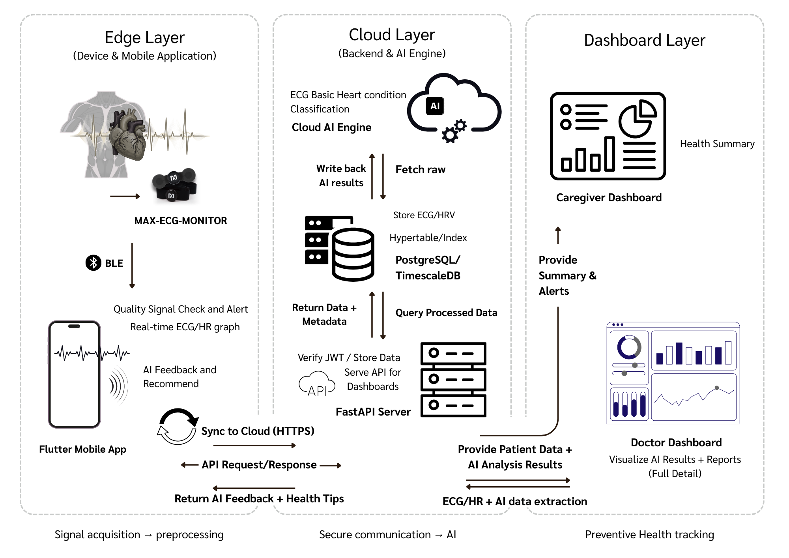

# SmartHeart Care – End-to-End AI Health Monitoring System

SmartHeart Care is a **prototype preventive healthcare system** for continuous ECG
monitoring and AI-based heart condition classification.

This repository serves as the **system-level overview and architecture** of the
SmartHeart project.  
Implementation details are maintained in separate repositories.

---

## 🔗 Project Repositories

### 🧠 Core Capstone System
- **SmartHeart_Care**  
  Main capstone implementation including system logic, backend design, and integration plan  
  👉 https://github.com/tathana/SmartHeart_Care

### 📊 Baseline & Model Experiments
- **smartheart-ecg-analysis-test**  
  Baseline ECG model training, experiments, and evaluation  
  👉 https://github.com/tathana/smartheart-ecg-analysis-test

### 🎓 Course Demo / Prototype
- **ecg-streamlit-app**  
  Streamlit application for ECG classification (CNN image-based, course project)  
  👉 https://github.com/tathana/ecg-streamlit-app

---

## 🧩 System Overview

The SmartHeart system is designed using a **layered architecture**:

- **Edge Layer**  
  Wearable ECG device and Flutter mobile application for data acquisition and
  preliminary signal monitoring

- **Cloud Layer**  
  Backend API, time-series database, and AI analysis engine for ECG processing
  and heart condition classification

- **Dashboard Layer**  
  Caregiver and doctor dashboards for health summary, alerts, and visualization

---

## 🏗️ System Architecture

📄 Detailed system architecture and design documentation:  
- [System Architecture & Requirements (PDF)](docs/System requirement and Architecture.pdf)

---

## 🎯 Purpose of This Repository

- Provide a **single entry point** to understand the SmartHeart system  
- Present system architecture and design for reviewers and advisors  
- Link all related implementation repositories in a clear structure  

> This repository does not contain full implementation code.

---

## ⚠️ Disclaimer
This system is a **research and prototype platform** for preventive health
monitoring and is **not intended for medical diagnosis or clinical use**.
